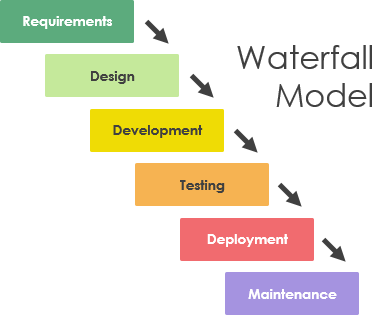

# SDLC
- Software Development Lifecycle
- There is not perfect official SDLC workflow
    - you will see different terminolgies
    - number steps
    - Some combine steps
1. Requirements
    - Initial of creating software
    - What does the application need to do?
        - User stories
    - What are the priorities of this application?
        - Usability
        - Speed
        - Reliabilty
        - looks amazing
2. Design
    - Create the interfaces of the application
    - Front-end 
        - UI for actual humans
    - Back-end and general architecture
        - What language are we using for our server?
        - What endpoints are there? 
        - What do our entities look like?
        - What services we might need?
3. Development/Testing
    - Implementation
    - Actually writing code and tests to verify that your code workd
4. Deployement
    - Packaging your software in a way that your clients can use it
        - Web Application might be deployed to AWS
            - Setting up web servers
            - Setting up production databases
        - Desktop App might be burned into CDs
5. Maitenence/monitoring
    - Monitoring the in production application
        - Viewing the amount of traffic it gets
        - Reviewing the logs generated by the application
        - Any comments or messages sent by client
            - reports bugs/ requested features etc....
### Waterfall Methodology
- Waterfall is the old school approach to building software applications
- You only go DOWN the waterfall NEVER back up
- Rigid and contract based
    - If you realize some interface is poorly design.... too bad
    - You are NOT going to go back and redesign it

### Agile
- Agile is the more modern approach
- It is a mindset
- Agile is NOT a specifc practice or set of processes
    - implementations of agile are
        - Scrum
        - Kanban
- Agile manifesto (core tenets)
    - Individuals and interactions over processes and tools
        - One of waterfall's biggest problem was red tape and team hierarchy preventing bewteen communicating succesffully to solve problem.
        - Horizontal vs vertical teams
    - Working software over comprehensive documentation
        - Waterfall had a HEAVY emphasis on documentation
            - SRS really explicit technial documents
        - Working demos explain progess and how the applicaiton is supposed to work way better than the best written docuemention in the world.
    - Customer collaboration over contract negotiation
        - Waterfall would generate a litigous SRS document with inflexible requirements
        - Clients do not really know what they want. They emphasize the wrong things
        - Better to have weekly updates with the client with demos
    - Responding to change over following a plan
        - be AGILE and willing to adapt to the project
        - Software Engineering is very flexible and editable compared to other fields
            - If a bridge engineer designs the concrete foundation in a non optimal way
                - He cannot ctl + Z
        - You can go back and redisgn make upates

